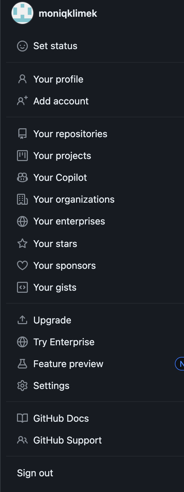

Steps:

1. Please open page - github - https://github.com/
2. create account 
3. when we have our account created please see - Right corner - icon with your name -  Button: Your repository
   
4. repositories and button NEW (green)- 
5.  - you need write:
   - name for your repository - you can put whatever you need , but please be aware that this name will be visible in link - so i propose something easy to remember and short :)
   - decsription field is optional you can add some text hear or not
   - very important please mark - PUBLIC (because in another case your Mentor can't see your code, and he/she doesnt have permission to open your link)
After this green button - create repository (attachment 4)
6. attachment 4a - please see blue description - creating a new file , uploading an existing file . Please choose first time - creating a new file
7. attachment 5 - we switch to our dictionary in laptop where we have our file/s (with our solution) which we want to send to our mentor.
   you can now drag files to windows or choose your files (2 option available)
   you can add additional comments - this field are optional you can describe what is inside your file
     
   Last step - green button 'Commit changes'

Good luck !
